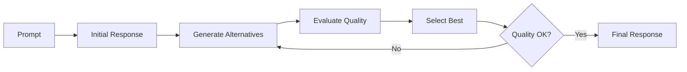
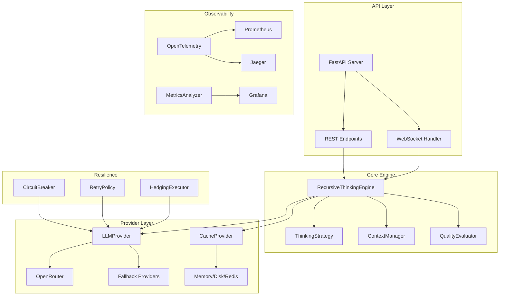

# 🧠 Multi-stage Intelligence Looping System (MILS)

[](https://opensource.org/licenses/MIT)
[](https://www.python.org/downloads/)
[](https://fastapi.tiangolo.com/)

> MILS is a modular engine for recursively evaluating, refining, and selecting reasoning outputs across iterative stages. Originally forked from CoTR, MILS refactors the system into a modular, executable reasoning system with multi-stage intelligence loops at its core.

---

## 🚀 Features

* 🔄 Recursive thinking loop with multi-pass self-correction
* 🎯 Adaptive round depth based on prompt complexity
* ⚡ Parallel alternatives to explore diverse reasoning paths
* 🔌 Modular architecture with pluggable LLM, cache, and strategy layers
* 📊 Observability-first: built-in metrics, tracing, and resilience support
* 🗂️ Role-based model policies for fine-grained model selection
* 💸 Budget caps with real-time cost tracking

---

## 📚 Table of Contents

* [Why CoRT?](#why-cort)
* [Quick Start](#quick-start)
* [🏗️ Architecture Overview](#️architecture-overview)
* [Basic API Usage](#basic-api-usage)
* [Extending CoRT](#extending-cort)
* [Monitoring & Testing](#monitoring--testing)
* [Roadmap & Limitations](#roadmap--limitations)
* [Contributing](#contributing)
* [Acknowledgments](#acknowledgments)
* [License](#license)

---

## ❓ Why CoRT?

Typical LLM workflows operate on a prompt→response basis. CoRT instead follows a recursive reasoning loop:



This enables:

* 🧠 Dynamic refinement through self-critique
* ✅ Error reduction and quality convergence
* 🧩 Improved performance on complex queries

---

## ⚡ Quick Start

1. Clone & install
   `git clone https://github.com/DqkrLord0Xerod/Multistage-Intelligence-Looping-System.git`
   `cd Multistage-Intelligence-Looping-System`
   `pip install -r requirements.txt`

2. Configure
   Create a `.env` file and set at minimum:
   ```
   OPENROUTER_API_KEY=your-key
   APP_ENV=development
   FRONTEND_URL=http://localhost:3000
   ```
   See `config/config.py` for all available options.

3. Run server
   `uvicorn recthink_web:app --reload`

For CLI mode, frontend setup, and advanced options, see `docs/USAGE.md`.

---

## 🏗️ Architecture Overview



### Key Components

| Component               | Purpose                         | Location                             |
| ----------------------- | ------------------------------- | ------------------------------------ |
| RecursiveThinkingEngine | Manages thinking loop logic     | `core/chat_v2.py`                    |
| LLMProvider             | Unified interface for LLMs      | `core/providers/llm.py`              |
| CacheProvider           | Response caching infrastructure | `core/providers/cache.py`            |
| QualityEvaluator        | Scores and compares responses   | `core/providers/quality.py`          |
| CircuitBreaker          | Limits cascading failures       | `core/resilience/circuit_breaker.py` |
| MetricsAnalyzer         | Real-time performance metrics   | `monitoring/metrics_v2.py`           |

### Architectural Transition

⚠️ **Note**: CoRT is transitioning from a v1 monolith to a clean v2 architecture.

* **Current API**: `recthink_web.py` still runs on legacy v1 logic
* **v2 Core Engine**: `core/chat_v2.py` is modular and ready
* **Migration Guide**: See `claude/cort-migration-guide.txt`

---

## 📬 Basic API Usage

Example request:

`curl -X POST http://localhost:8000/api/send_message -H "Content-Type: application/json" -d '{"session_id":"sess1","message":"Hello, CoRT!","thinking_rounds":2}'`

### v2 Endpoints

The updated `recthink_web_v2.py` server exposes the following endpoints:

| Method/Path           | Description                            |
| --------------------- | -------------------------------------- |
| `POST /chat`          | Run a reasoning cycle and return the final response |
| `WS   /ws/{session}`  | Interactive WebSocket for single replies |
| `WS   /ws/stream/{session}` | Stream intermediate thinking updates |

Full API reference available in `docs/API_REFERENCE.md`.

### Session setup & cost tracking

Begin a new session via `/api/initialize` with optional parameters:

```bash
curl -X POST http://localhost:8000/api/initialize \
  -H "Content-Type: application/json" \
  -d '{
        "api_key": "YOUR_KEY",
        "model": "mistralai/mistral-small-3.1-24b-instruct:free",
        "budget_token_limit": 5000,
        "enforce_budget": true
      }'
```

Costs are tracked per session and can be queried at `/api/cost/{session_id}`.
WebSocket responses include `cost_total` and `cost_this_step` for real-time updates.

---

## 🔌 Extending CoRT

Want to integrate a new LLM, cache, or thinking module? Start here:

Current provider classes include:
- `OpenRouterLLMProvider`
- `OpenAILLMProvider`
- `MultiProviderLLM` and `ResilientLLMProvider` for failover setups.

### Model policies

`ModelSelector` lets you choose specific models for different roles.
Pass a policy mapping when creating `CoRTConfig`:

```python
from core.chat_v2 import CoRTConfig, create_default_engine

config = CoRTConfig(
    api_key="KEY",
    model_policy={"assistant": "gpt-3.5-turbo", "critic": "gpt-4"},
)
engine = create_default_engine(config)
```

* `docs/EXTENDING.md#custom-providers`
* `docs/EXTENDING.md#custom-strategies`

---

## 📈 Monitoring & Testing

* Metrics & tracing setup → `docs/MONITORING.md`
* Run tests → `pytest` or `pytest --cov`

---

## 📅 Roadmap & Limitations

Upcoming priorities:

* Full v2 production API migration
* Redis cache backend
* Native OpenAI & Anthropic support
* Quality benchmarking

See `docs/ROADMAP.md` for details.

---

## 🤝 Contributing

We welcome contributions! You can:

* Fork the repo and open a PR
* Suggest improvements or file issues
* Review `AGENTS.md` for contributor guidelines

---

## 🙏 Acknowledgments

This project builds on PhialsBasement’s original [Chain-of-Recursive-Thoughts](https://github.com/PhialsBasement/Chain-of-Recursive-Thoughts).

Enhancements in this fork:

* ✅ Dependency injection and async execution
* ✅ Modular, layered architecture
* ✅ Persistent agent orchestration and automation
* ✅ Platform-oriented focus beyond single scripts

Thanks to:

* Original idea: *“AI that argues with itself”* by PhialsBasement
* Visuals and recursive logic inspired by early prototypes

---

## 📄 License

This project is licensed under the [MIT License](LICENSE).
