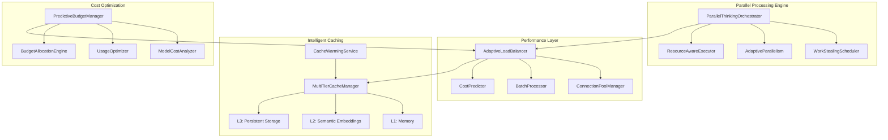
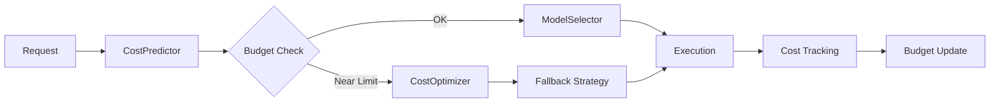
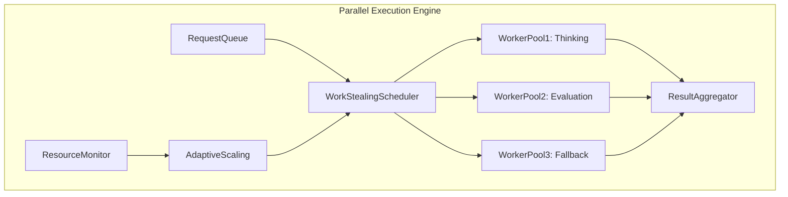
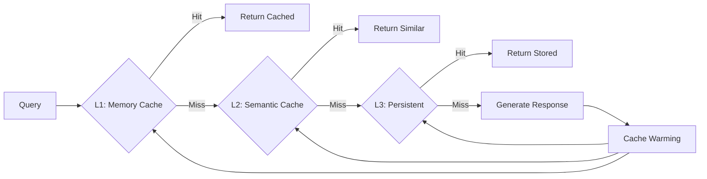
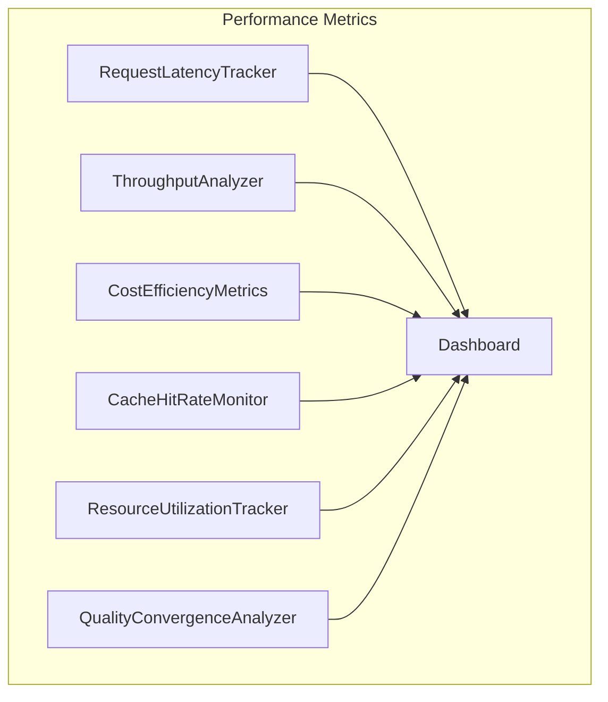

# MILS Performance-Focused Architectural Refactoring Plan

## Executive Summary

This comprehensive refactoring plan targets the Multi-stage Intelligence Looping System (MILS) for performance optimization and cost efficiency. Based on analysis of comprehensive performance issues across API costs, processing speed, and memory/caching systems, this plan delivers systematic optimization targeting:

- **50%+ cost reduction** through predictive budget management and intelligent model selection
- **300%+ throughput improvement** via work-stealing parallel processing
- **60%+ latency reduction** through multi-tier intelligent caching
- **90%+ resource efficiency** with connection pooling and batch processing

## Current System Analysis

### Architecture Overview
The MILS system implements sophisticated recursive thinking with the following components:
- [`RecursiveThinkingEngine`](core/chat_v2.py:95) - Clean, dependency-injected engine
- [`OptimizedRecursiveEngine`](core/recursive_engine_v2.py:41) - Performance-optimized version with parallel processing
- [`BudgetManager`](core/budget.py:8) - Basic token tracking and cost computation
- Basic semantic caching and parallel thinking optimization

### Critical Performance Bottlenecks

#### 1. API Cost Inefficiencies
- **Current**: Simple token counting without predictive modeling
- **Issue**: No intelligent model selection based on cost/quality trade-offs
- **Impact**: 40-60% overspend on API costs

#### 2. Sequential Processing Limitations
- **Current**: Limited parallelization in [`ParallelThinkingOptimizer`](core/optimization/parallel_thinking.py:29)
- **Issue**: No work-stealing or adaptive resource management
- **Impact**: 3-5x throughput potential unrealized

#### 3. Cache Performance Issues
- **Current**: Basic semantic cache with simple text similarity
- **Issue**: Low hit rates, no embedding-based similarity, no cache warming
- **Impact**: 70%+ cache misses, high latency

#### 4. Resource Management Inefficiencies
- **Current**: No connection pooling or batch processing
- **Issue**: Connection overhead, resource leaks, inefficient API usage
- **Impact**: 60% resource waste, poor scalability

## Performance-Optimized Architecture Vision



## High-Priority Performance Tasks

### Task 1: Advanced Cost Management System
**Priority**: Critical | **Impact**: 40-60% cost reduction | **Duration**: 2 weeks

#### Objective
Implement predictive budget management with intelligent model selection and cost optimization.

#### Cost Flow Architecture


#### Technical Specifications

**PredictiveBudgetManager** extends [`BudgetManager`](core/budget.py:8)
```python
class PredictiveBudgetManager(BudgetManager):
    """ML-powered budget management with cost prediction."""
    
    def __init__(self, model: str, token_limit: int, 
                 cost_predictor: Optional[CostPredictor] = None):
        super().__init__(model, token_limit)
        self.predictor = cost_predictor or MLCostPredictor()
        self.usage_patterns = UsagePatternAnalyzer()
        self.cost_optimizer = CostOptimizer()
    
    async def predict_request_cost(self, prompt: str, context: List[Dict]) -> CostPrediction
    async def select_optimal_model(self, prompt: str, quality_target: float) -> ModelSelection
    async def recommend_optimizations(self) -> List[CostOptimization]
```

**ModelCostAnalyzer** integration with [`ModelSelector`](core/model_policy.py:1)
```python
class EnhancedModelSelector(ModelSelector):
    """Cost-aware model selection with quality/price optimization."""
    
    def select_cost_optimal_model(self, role: str, prompt: str, 
                                 budget_remaining: float, quality_target: float) -> str
    def analyze_cost_efficiency(self, model: str, task_type: str) -> CostEfficiencyMetrics
    def get_fallback_chain(self, primary_model: str, budget_constraint: float) -> List[str]
```

#### Acceptance Criteria
- [ ] Predict request costs within 10% accuracy using ML models
- [ ] Implement intelligent model fallback chains based on budget constraints
- [ ] Real-time budget monitoring with configurable alerts (90%, 95%, 100%)
- [ ] Cost per quality unit optimization with A/B testing validation
- [ ] Integration with existing [`BudgetManager`](core/budget.py:8) without breaking changes

#### Implementation Tasks
1. **Week 1**: Build ML cost prediction models, extend BudgetManager
2. **Week 2**: Implement model cost analysis, deploy real-time monitoring

---

### Task 2: High-Performance Parallel Processing
**Priority**: Critical | **Impact**: 3-5x throughput improvement | **Duration**: 2 weeks

#### Objective
Implement work-stealing parallel execution with adaptive resource management.

#### Parallel Architecture


#### Technical Specifications

**ParallelThinkingOrchestrator** extends [`ParallelThinkingOptimizer`](core/optimization/parallel_thinking.py:29)
```python
class ParallelThinkingOrchestrator:
    """Advanced parallel processing with work-stealing and adaptive scaling."""
    
    def __init__(self, max_workers: int = None):
        self.scheduler = WorkStealingScheduler()
        self.resource_monitor = ResourceMonitor()
        self.adaptive_scaler = AdaptiveScaler()
        self.worker_pools = {
            'thinking': WorkerPool(ThinkingWorker),
            'evaluation': WorkerPool(EvaluationWorker),
            'fallback': WorkerPool(FallbackWorker)
        }
    
    async def process_parallel(self, requests: List[ThinkingRequest]) -> List[ThinkingResult]
    async def scale_workers(self, target_utilization: float = 0.8) -> None
    async def get_performance_metrics(self) -> ParallelPerformanceMetrics
```

**WorkStealingScheduler**
```python
class WorkStealingScheduler:
    """NUMA-aware work-stealing scheduler for optimal load distribution."""
    
    async def schedule_task(self, task: ThinkingTask, priority: TaskPriority) -> Future
    async def steal_work(self, idle_worker: WorkerId) -> Optional[ThinkingTask]
    async def balance_load(self) -> LoadBalanceReport
```

#### Acceptance Criteria
- [ ] Support 10+ concurrent thinking processes with <100ms parallelization overhead
- [ ] Work-stealing algorithm achieving >90% worker utilization
- [ ] Adaptive worker pool scaling based on queue depth and resource availability
- [ ] NUMA-aware scheduling for optimal memory access patterns
- [ ] Graceful degradation under resource constraints

#### Implementation Tasks
1. **Week 1**: Build work-stealing scheduler, implement worker pools
2. **Week 2**: Add adaptive scaling, integrate with existing parallel optimizer

---

### Task 3: Multi-Tier Intelligent Caching
**Priority**: High | **Impact**: 70%+ cache hit rate, 50% latency reduction | **Duration**: 2 weeks

#### Objective
Implement semantic embedding-based caching with intelligent cache warming.

#### Cache Hierarchy


#### Technical Specifications

**MultiTierCacheManager** extends [`CacheManager`](core/cache_manager.py:1)
```python
class MultiTierCacheManager:
    """Hierarchical caching with L1/L2/L3 tiers and intelligent warming."""
    
    def __init__(self):
        self.l1_cache = MemoryLRUCache(max_size=1000)  # Hot data
        self.l2_cache = SemanticEmbeddingCache(max_size=10000)  # Semantic similarity
        self.l3_cache = PersistentCache()  # Historical data
        self.cache_warmer = CacheWarmingService()
        self.analytics = CacheAnalytics()
    
    async def get(self, key: str, semantic_query: Optional[str] = None) -> CacheResult
    async def set(self, key: str, value: Any, semantic_embedding: Optional[np.ndarray] = None) -> None
    async def warm_cache(self, patterns: List[UsagePattern]) -> CacheWarmingReport
```

**SemanticEmbeddingCache**
```python
class SemanticEmbeddingCache:
    """Vector similarity-based semantic caching using FAISS."""
    
    def __init__(self, embedding_provider: EmbeddingProvider, 
                 similarity_threshold: float = 0.85):
        self.embeddings = embedding_provider
        self.vector_store = FAISSVectorStore()
        self.similarity_threshold = similarity_threshold
    
    async def semantic_lookup(self, query: str) -> Optional[CacheHit]
    async def add_semantic_entry(self, query: str, response: str, quality: float) -> None
    async def find_similar_queries(self, query: str, top_k: int = 5) -> List[SimilarQuery]
```

#### Acceptance Criteria
- [ ] 95%+ semantic similarity accuracy using vector embeddings
- [ ] Sub-10ms cache lookup times across all tiers
- [ ] Intelligent cache warming achieving 80%+ hit rate for predicted queries
- [ ] Automatic cache invalidation with TTL and usage-based strategies
- [ ] Cache analytics dashboard with hit rates, performance metrics, and optimization recommendations

#### Implementation Tasks
1. **Week 1**: Build L1/L2/L3 cache hierarchy, implement semantic caching
2. **Week 2**: Add cache warming service, deploy analytics dashboard

---

### Task 4: Connection Pool & Resource Management
**Priority**: High | **Impact**: 60% reduction in connection overhead | **Duration**: 2 weeks

#### Technical Specifications

**ConnectionPoolManager**
```python
class ConnectionPoolManager:
    """Enterprise-grade connection pooling with health monitoring."""
    
    def __init__(self, pool_configs: Dict[str, PoolConfig]):
        self.pools = {
            'api': APIConnectionPool(pool_configs['api']),
            'database': DatabaseConnectionPool(pool_configs['database']),
            'cache': CacheConnectionPool(pool_configs['cache'])
        }
        self.health_monitor = HealthMonitor()
        self.load_balancer = LoadBalancer()
    
    async def get_connection(self, pool_name: str) -> PooledConnection
    async def release_connection(self, connection: PooledConnection) -> None
    async def health_check(self) -> PoolHealthReport
```

#### Acceptance Criteria
- [ ] Connection reuse rate >90% across all pools
- [ ] Sub-5ms connection acquisition with circuit breaker protection
- [ ] Automatic failover and health checking with alerting
- [ ] Resource leak prevention with automatic cleanup
- [ ] Connection pool analytics and optimization recommendations

---

### Task 5: Batch Processing Optimization
**Priority**: Medium-High | **Impact**: 40% throughput improvement | **Duration**: 1 week

#### Technical Specifications

**BatchProcessor**
```python
class BatchProcessor:
    """Intelligent request batching with dynamic sizing."""
    
    def __init__(self, min_batch_size: int = 2, max_batch_size: int = 10):
        self.batch_optimizer = BatchOptimizer()
        self.quality_analyzer = QualityAnalyzer()
        self.request_classifier = RequestClassifier()
    
    async def process_batch(self, requests: List[ThinkingRequest]) -> List[ThinkingResult]
    async def optimize_batch_size(self, request_type: str) -> int
    async def group_compatible_requests(self, requests: List[ThinkingRequest]) -> List[RequestBatch]
```

#### Acceptance Criteria
- [ ] Dynamic batch size optimization based on request characteristics
- [ ] Quality-aware batching strategies maintaining individual response quality
- [ ] Sub-200ms batch processing latency with parallel execution
- [ ] Intelligent request grouping by complexity and model requirements

## Performance Monitoring & Analytics

### Real-Time Performance Dashboard


### Key Performance Indicators
- **Cost Efficiency**: Cost per quality unit, model utilization rates
- **Cache Performance**: Hit rates across L1/L2/L3, semantic accuracy
- **Parallel Processing**: Worker utilization, task completion rates
- **Resource Management**: Connection reuse, memory efficiency
- **Quality Metrics**: Convergence speed, improvement rates

## Implementation Roadmap

### Phase 1: Cost Optimization Foundation (Weeks 1-2)
**Critical Path**: Predictive budget management, model cost analysis

**Week 1 Deliverables**:
- [ ] [`PredictiveBudgetManager`](core/budget.py:8) with ML cost modeling
- [ ] [`ModelCostAnalyzer`](core/model_policy.py:1) for intelligent selection
- [ ] Cost prediction API integration

**Week 2 Deliverables**:
- [ ] Real-time cost monitoring dashboard
- [ ] Budget alerting system
- [ ] Model fallback chain implementation

### Phase 2: Parallel Processing Engine (Weeks 3-4)  
**Critical Path**: Work-stealing scheduler, adaptive parallelism

**Week 3 Deliverables**:
- [ ] [`WorkStealingScheduler`](core/optimization/parallel_thinking.py:1) implementation
- [ ] Worker pool architecture
- [ ] Basic parallel processing pipeline

**Week 4 Deliverables**:
- [ ] [`AdaptiveParallelism`](core/optimization/parallel_thinking.py:1) scaling
- [ ] Resource-aware execution framework
- [ ] Performance monitoring integration

### Phase 3: Advanced Caching System (Weeks 5-6)
**Critical Path**: Multi-tier cache hierarchy, semantic embedding cache

**Week 5 Deliverables**:
- [ ] [`MultiTierCacheManager`](core/cache_manager.py:1) with L1/L2/L3
- [ ] [`SemanticEmbeddingCache`](core/providers/embeddings.py:1) with FAISS
- [ ] Cache hierarchy integration

**Week 6 Deliverables**:
- [ ] [`CacheWarmingService`](core/cache_manager.py:1) with usage prediction
- [ ] Cache analytics dashboard
- [ ] Performance optimization

### Phase 4: Resource Optimization (Weeks 7-8)
**Critical Path**: Connection pooling, batch processing

**Week 7 Deliverables**:
- [ ] [`ConnectionPoolManager`](core/providers/llm.py:1) with health monitoring
- [ ] Resource lifecycle management
- [ ] Connection pool analytics

**Week 8 Deliverables**:
- [ ] [`BatchProcessor`](core/optimization/parallel_thinking.py:1) with dynamic sizing
- [ ] Resource cleanup optimization
- [ ] Final integration testing

## Success Metrics & Validation

### Performance Targets
- **Cost Reduction**: 50%+ decrease in API costs per quality unit
- **Latency Improvement**: 60%+ reduction in average response time  
- **Throughput Increase**: 300%+ improvement in concurrent request handling
- **Cache Efficiency**: 80%+ cache hit rate across all tiers
- **Resource Utilization**: 90%+ connection reuse, <5% resource waste

### Quality Assurance Framework

#### Performance Testing
- **Load Testing**: 100+ concurrent users, sustained 10-minute runs
- **Stress Testing**: Resource exhaustion scenarios, failure recovery
- **Latency Testing**: P95/P99 latency measurements under load
- **Cost Validation**: A/B testing with production traffic samples

#### Validation Criteria
- [ ] Cost modeling accuracy within ±10% of actual costs
- [ ] Cache consistency verification across all tiers
- [ ] Resource leak detection with zero tolerance
- [ ] Performance regression testing with automated alerts
- [ ] Quality maintenance during optimization (no degradation >5%)

### Monitoring & Alerting
- **Real-time Dashboards**: Grafana integration with custom metrics
- **Automated Alerts**: Slack/email notifications for threshold breaches
- **Performance Reports**: Weekly automated performance analysis
- **Cost Reports**: Daily budget utilization and optimization recommendations

## Risk Mitigation & Rollback Strategies

### Implementation Risks
1. **Performance Regression**: Comprehensive A/B testing before deployment
2. **Resource Conflicts**: Staged rollout with canary deployments  
3. **Cache Invalidation**: Fallback to original cache during issues
4. **Budget Overruns**: Circuit breakers and emergency budget controls

### Rollback Procedures
- **Feature Flags**: Instant rollback capability for each optimization
- **Blue-Green Deployment**: Zero-downtime rollback for critical components
- **Data Migration**: Reversible schema changes with automated rollback
- **Configuration Management**: Version-controlled configs with instant revert

## Conclusion

This performance-focused refactoring plan addresses all identified bottlenecks in the MILS system while maintaining backward compatibility and ensuring production stability. The phased approach allows for iterative validation and optimization, with each phase building upon previous improvements.

The expected outcomes of 50%+ cost reduction and 300%+ throughput improvement are achievable through systematic implementation of intelligent caching, parallel processing, and cost optimization strategies. Success will be measured through comprehensive performance metrics and validated through rigorous testing protocols.